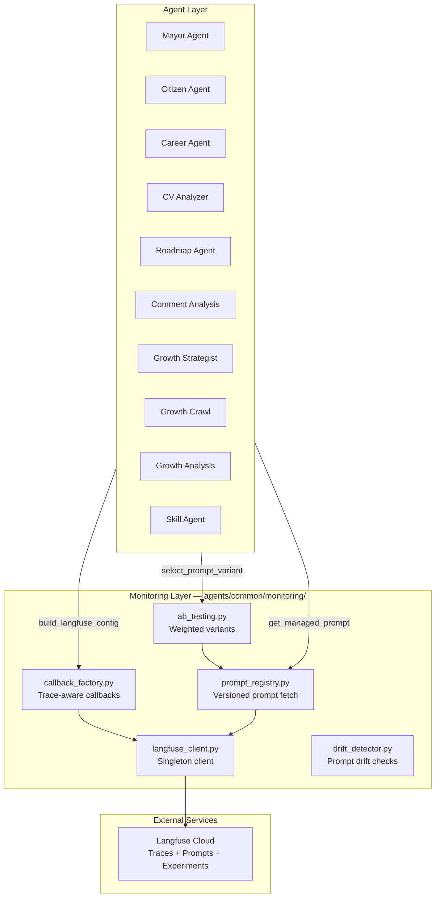
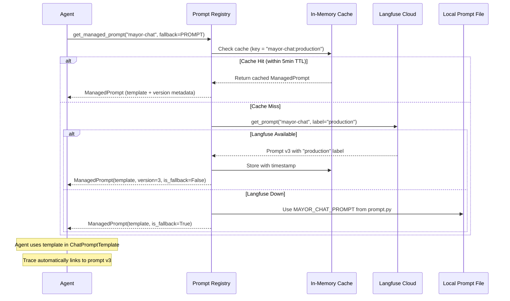
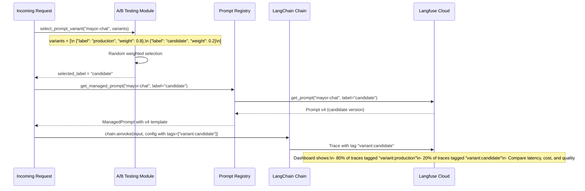

# Monitoring Layer — Langfuse Observability

> Production-grade LLM tracing, prompt versioning, A/B testing, and drift detection for all Pegasus agents.

## Architecture



## Quick Start

### 1. Set environment variables

```bash
LANGFUSE_SECRET_KEY=sk-lf-...
LANGFUSE_PUBLIC_KEY=pk-lf-...
LANGFUSE_BASE_URL=https://cloud.langfuse.com
```

### 2. Add tracing to any agent (2 lines of code)

```python
from backend.agents.common.monitoring import build_langfuse_config

# Create a config with callbacks — empty dict if Langfuse is not configured
config = build_langfuse_config(agent_name="my-agent", user_id="u-123")

# Pass it to any LangChain invoke call
result = await chain.ainvoke({"input": "..."}, config=config)
```

### 3. View traces in Langfuse dashboard

Open your Langfuse project → Traces → filter by agent name.

---

## Module Reference

| File | Purpose | Key Function |
|------|---------|-------------|
| `langfuse_client.py` | Singleton Langfuse connection | `get_langfuse()` |
| `callback_factory.py` | Creates LangChain callbacks with trace metadata | `build_langfuse_config()` |
| `prompt_registry.py` | Fetch versioned prompts with local fallback | `get_managed_prompt()` |
| `ab_testing.py` | Weighted prompt variant selection | `select_prompt_variant()` |
| `drift_detector.py` | Detect prompt drift between code and Langfuse | `check_prompt_drift()` |

---

## Prompt Versioning — Deep Dive

### The Problem

Hardcoded prompts in Python files mean:
- Changing a prompt requires a code deployment
- No history of what changed, when, or why
- No way to compare prompt versions against each other
- No audit trail linking a trace to the exact prompt that produced it

### The Solution



### How Versions Work in Langfuse

Every prompt in Langfuse has:
- **Name**: A stable identifier (e.g., `"mayor-chat"`)
- **Versions**: Each edit creates a new version (v1, v2, v3...)
- **Labels**: Tags like `"production"`, `"candidate"`, `"latest"`

```
mayor-chat
  ├── v1 (created Jan 15)  [archived]
  ├── v2 (created Feb 2)   [archived]
  ├── v3 (created Mar 10)  [production]     ← agents fetch this
  └── v4 (created Mar 20)  [candidate]      ← A/B test candidate
```

**Key concept**: Labels are movable pointers. When you promote v4 to production,
you move the `"production"` label from v3 to v4. Agents automatically pick up
the new version on next cache refresh (within 5 minutes).

### How to Update a Prompt

1. Open Langfuse → Prompts → select the prompt
2. Edit the text and save → creates a new version
3. The new version gets the `"latest"` label automatically
4. To deploy: move the `"production"` label to the new version
5. Agents pick it up within 5 minutes (cache TTL)

### How Trace Linking Works

When `get_managed_prompt()` returns a `ManagedPrompt`, it includes the raw
Langfuse prompt object. The agent passes this as metadata to `ChatPromptTemplate`:

```python
prompt = get_managed_prompt("mayor-chat", fallback=MAYOR_PROMPT)
template = ChatPromptTemplate.from_messages(
    [("system", prompt.template)],
    metadata={"langfuse_prompt": prompt.langfuse_prompt},  # ← this links it
)
```

In the Langfuse dashboard, every trace shows which prompt version produced it.

---

## A/B Testing — Deep Dive

### The Problem

You've rewritten a prompt. Is it better? Without data, you're guessing.

### The Solution: Live Traffic Splitting



### Step-by-Step: Running an A/B Test

**Step 1: Create the candidate prompt in Langfuse**
- Go to Prompts → "mayor-chat" → Edit
- Save new version → label it `"candidate"`

**Step 2: Add A/B test config to your agent**
```python
from backend.agents.common.monitoring import (
    select_prompt_variant,
    get_managed_prompt,
    build_langfuse_config,
)

# Define traffic split
variants = [
    {"label": "production", "weight": 0.8},  # 80% current prompt
    {"label": "candidate", "weight": 0.2},   # 20% new prompt
]

# Select variant for this request
selected_label = select_prompt_variant("mayor-chat", variants)

# Fetch the selected prompt version
prompt = get_managed_prompt("mayor-chat", fallback=FALLBACK, label=selected_label)

# Tag the trace with the variant
config = build_langfuse_config(
    agent_name="mayor-chat",
    tags=[f"variant:{selected_label}"],
)

# Run the chain — trace is automatically linked to prompt version + variant
result = await chain.ainvoke({"input": "..."}, config=config)
```

**Step 3: Monitor in Langfuse**
- Filter traces by tag: `variant:production` vs `variant:candidate`
- Compare: latency, token usage, error rates
- Add user feedback scores for quality comparison

**Step 4: Decide and promote**
- Candidate wins? → Move `"production"` label to v4 in Langfuse
- Remove A/B test config from code
- No deployment needed for the prompt change!

### When to Use A/B Testing vs Experiments

| Scenario | Use |
|----------|-----|
| Live user traffic, measure real-world impact | **A/B Testing** (select_prompt_variant) |
| Offline evaluation before deploying | **Experiments** (run_experiment with datasets) |
| Quick regression check | **Experiments** |
| Measuring user satisfaction | **A/B Testing** |

---

## Drift Detection

Drift happens when local fallback prompts diverge from Langfuse prompts.

```python
from backend.agents.common.monitoring import check_prompt_drift
from backend.agents.mayor.prompt import MAYOR_CHAT_PROMPT

report = check_prompt_drift("mayor-chat", MAYOR_CHAT_PROMPT)
print(report.status)       # "synced", "drifted", or "unknown"
print(report.diff_summary)  # Human-readable explanation
```

Run at app startup or as a periodic health check.

---

## Graceful Degradation

Every component degrades gracefully when Langfuse is unavailable:

| Component | When Langfuse is down |
|-----------|----------------------|
| `get_langfuse()` | Returns `None` |
| `build_langfuse_config()` | Returns `{}` (empty config) |
| `get_managed_prompt()` | Returns local fallback prompt |
| `select_prompt_variant()` | Still works (pure random, no Langfuse needed) |
| `check_prompt_drift()` | Returns `status="unknown"` |

**Agents never fail because of monitoring.** If Langfuse is down, everything
runs exactly as it did before monitoring was added — just without traces.

---

## Traced Agents

All agents in Pegasus are traced with the following Langfuse trace names:

| Agent | Trace Name | Tags |
|-------|-----------|------|
| Mayor Chat | `mayor-chat` | — |
| Citizen Chat | `citizen-chat` | — |
| Career Analysis | `career-analysis` | — |
| Career Chat | `career-chat` | — |
| CV Page Analysis | `cv-page-analysis` | — |
| CV Role Synthesis | `cv-role-synthesis` | — |
| Civic Roadmap | `civic-roadmap` | — |
| Comment Analysis | `comment-analysis` | — |
| Growth Strategist | `growth-strategist` | — |
| Growth Crawl | `growth-crawl` | — |
| Growth Analysis (preliminary) | `growth-analysis-preliminary` | — |
| Growth Analysis (final) | `growth-analysis-final` | — |
| Growth Skill | `growth-skill` | `skill:{name}` |
