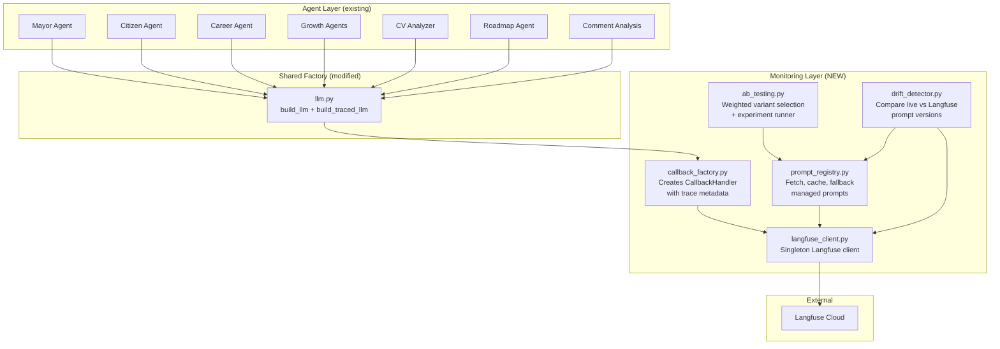
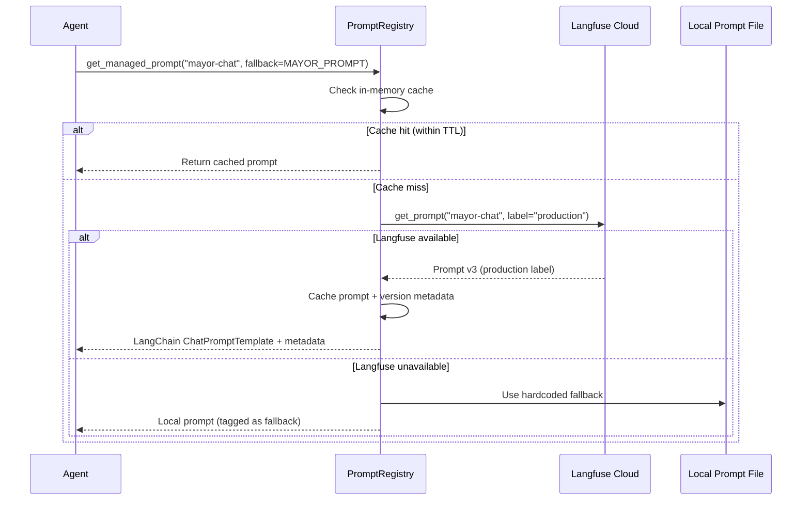
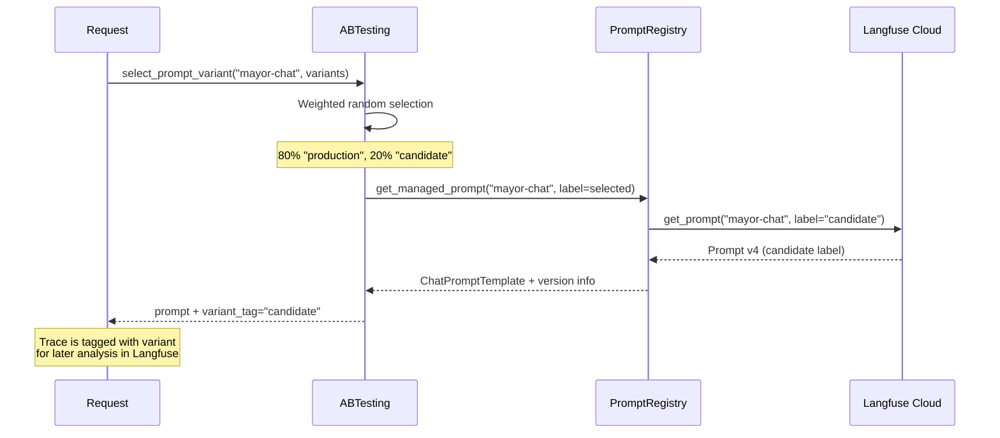

# Langfuse Monitoring, Prompt Versioning & A/B Testing — Design Spec

## Goal

Add production-grade LLM observability to every agent in the Pegasus backend using Langfuse. This includes: full trace/span visibility, managed prompt versioning, A/B testing between prompt variants, and drift detection.

## Architecture Overview



## Components

### 1. `langfuse_client.py` — Singleton Client

- Reads `LANGFUSE_SECRET_KEY`, `LANGFUSE_PUBLIC_KEY`, `LANGFUSE_BASE_URL` from env
- Exposes `get_langfuse()` returning a singleton `Langfuse` instance
- Handles graceful degradation: if keys are missing, returns `None` and all monitoring becomes a no-op

### 2. `callback_factory.py` — Trace-Aware Callback Factory

- `create_callback_handler(agent_name, user_id?, session_id?, tags?)` → `CallbackHandler`
- Every LLM call gets a callback handler with structured metadata
- Agent name becomes the trace name for easy filtering in Langfuse dashboard

### 3. `prompt_registry.py` — Managed Prompt Versioning

- `get_managed_prompt(name, fallback, label="production")` → `ChatPromptTemplate`
- Fetches prompt from Langfuse by name and label
- Falls back to local hardcoded prompt if Langfuse is unreachable
- Caches prompts in-memory with TTL to avoid per-call latency
- Links prompt version to trace automatically via `metadata={"langfuse_prompt": prompt}`

### 4. `ab_testing.py` — Weighted Variant Selection

- `select_prompt_variant(prompt_name, variants)` → selected prompt + variant tag
- Variants defined as `[{"label": "production", "weight": 0.8}, {"label": "candidate", "weight": 0.2}]`
- Selection is random-weighted per call
- Tags the trace with the selected variant for filtering in Langfuse
- `run_experiment(dataset_name, prompt_name, task_fn)` — runs a Langfuse dataset experiment

### 5. `drift_detector.py` — Prompt Drift Detection

- `check_prompt_drift(prompt_name, local_prompt)` → `DriftReport`
- Compares the local fallback prompt against the Langfuse "production" version
- Returns a report: `is_drifted`, `local_hash`, `remote_hash`, `diff_summary`
- Designed to run as a startup check or periodic background task

### 6. `llm.py` modifications

- Add `build_traced_llm()` that wraps `build_llm()` and returns both the LLM and a callback handler
- Existing `build_llm()` stays unchanged for backward compat
- New helper: `build_traced_chain(agent_name, prompt_template, structured_output?, ...)` that wires everything together

## Agent Migration Strategy

Each agent gets two changes:
1. Replace `build_llm()` with `build_traced_llm()` or use `build_traced_chain()`
2. Replace hardcoded `ChatPromptTemplate` with `get_managed_prompt()` call (with local fallback)

| Agent | Prompt Name in Langfuse | Local Fallback |
|-------|------------------------|----------------|
| Mayor | `mayor-chat` | `mayor/prompt.py` |
| Citizen | `citizen-chat` | `citizen/prompt.py` |
| Career | `career-chat` | `career/prompt.py` |
| CV Analyzer | `cv-page-analysis` | `cv_analyzers/prompts.py` |
| CV Synthesizer | `cv-role-synthesis` | `cv_analyzers/synthesizer.py` |
| Roadmap | `civic-roadmap` | `citizen/roadmap_agent.py` |
| Comment Analysis | `comment-analysis` | `mayor/prompt.py` (BATCH_ANALYSIS_PROMPT) |
| Growth Strategist | `growth-strategist` | `growth/prompts.py` |
| Growth Crawl | `growth-crawl` | `growth/prompts.py` |
| Growth Analysis (preliminary) | `growth-analysis-preliminary` | `growth/prompts.py` |
| Growth Analysis (final) | `growth-analysis-final` | `growth/prompts.py` |
| Skill Agent | `growth-skill` | `growth/skill_agent_prompt.py` |

## Prompt Versioning — How It Works



## A/B Testing — How It Works



## File Structure

```
backend/agents/common/
├── llm.py                          # Modified: add build_traced_llm(), build_traced_chain()
├── monitoring/
│   ├── __init__.py                 # Public API: re-exports from all modules
│   ├── langfuse_client.py          # Singleton Langfuse client
│   ├── callback_factory.py         # CallbackHandler factory with metadata
│   ├── prompt_registry.py          # Managed prompt fetch/cache/fallback
│   ├── ab_testing.py               # Weighted variant selection + experiments
│   └── drift_detector.py           # Prompt drift detection
```

## Non-Goals

- No custom Langfuse self-hosting — we use Langfuse Cloud
- No real-time alerting — drift detection is check-on-demand for now
- No UI changes — this is backend-only observability
